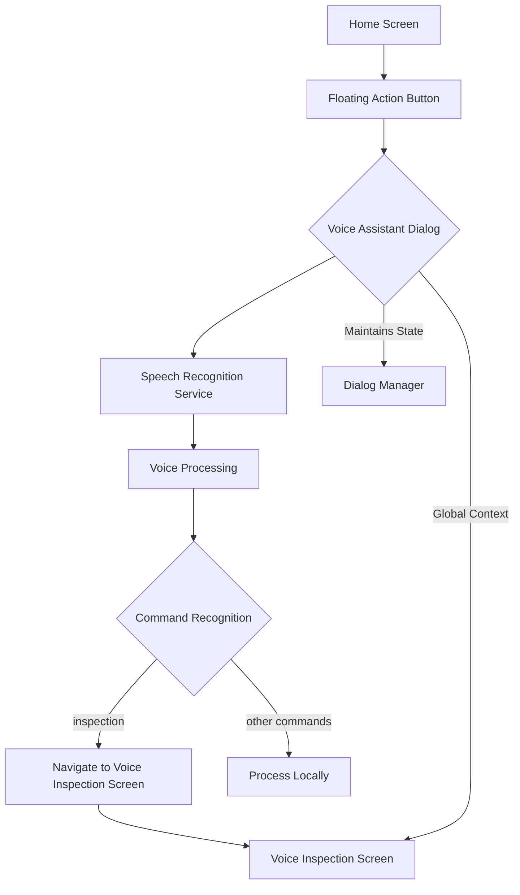
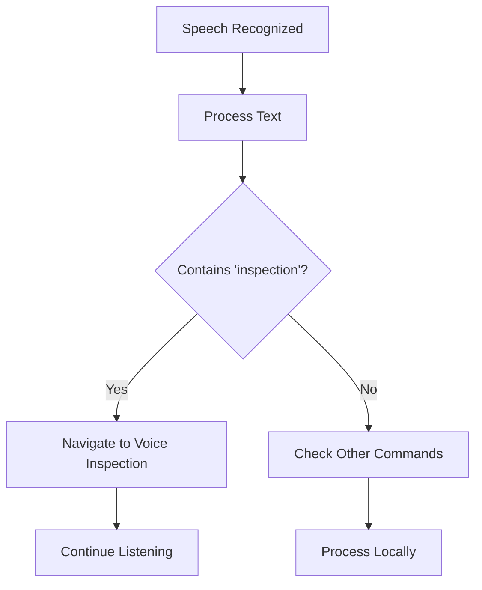

# Voice Assistant Navigation Feature Design

## 1. Overview

This document outlines the design for implementing a voice assistant feature in the SkyCypher Flutter application. The feature will include a floating action button on the home screen that, when pressed, opens a voice assistant dialog. When the user speaks the word "inspection", the app will navigate to the `voice_inspection_screen.dart` while maintaining the voice assistant dialog for continuous voice control.

The implementation will use a global dialog approach that maintains its context across screen navigations, allowing continuous voice interaction even after navigating to different screens. The dialog will be implemented as an overlay that persists above the navigation stack, ensuring it remains visible and functional regardless of which screen is currently active.

## 2. Architecture

The voice assistant feature will be implemented using a layered architecture approach:

1. **UI Layer**: Floating action button on home screen and voice assistant dialog
2. **Service Layer**: Voice recognition service using the `speech_to_text` package
3. **Navigation Layer**: Handling navigation to voice inspection screen while maintaining dialog context
4. **Business Logic Layer**: Command processing and navigation logic
5. **Global Context Layer**: Maintaining dialog state across navigation

### Component Interaction Diagram



## 3. Feature Implementation Details

### 3.1 Floating Action Button

A floating action button will be added to the home screen that triggers the voice assistant dialog when pressed.

**Location**: Bottom right corner of the home screen
**Icon**: Microphone icon
**Behavior**: Opens voice assistant dialog when pressed

**Integration with Home Screen**:
The FAB will be added to the Scaffold of the HomeScreen widget using the `floatingActionButton` property.

### 3.2 Voice Assistant Dialog

A persistent dialog that will:
- Listen for voice input continuously
- Process recognized speech in real-time
- Navigate to voice inspection screen when "inspection" is detected
- Remain active even after navigation

### 3.3 Speech Recognition Service

Implementation using the `speech_to_text` Flutter package:
- Initialize speech recognition
- Handle permissions (Android/iOS)
- Listen for continuous speech
- Process recognized text
- Handle errors and edge cases

**Dependencies to Add**:
```yaml
speech_to_text: ^6.1.1
```

### 3.4 Navigation Logic

Special navigation handling to:
- Navigate to voice inspection screen while preserving dialog context
- Maintain voice assistant dialog on top of the new screen
- Allow continued voice commands on the inspection screen

Implementation approach:
1. Use a global overlay to maintain dialog context
2. Navigate to voice inspection screen using standard navigation
3. Keep voice assistant dialog active using overlay mechanism
4. Pass aircraft data to voice inspection screen if needed

## 4. Data Models

### 4.1 VoiceCommand Model

```dart
class VoiceCommand {
  final String text;
  final double confidence;
  final DateTime timestamp;
  
  VoiceCommand({
    required this.text,
    required this.confidence,
    required this.timestamp,
  });
}
```

### 4.2 NavigationState Model

```dart
class NavigationState {
  final bool isDialogVisible;
  final String currentScreen;
  final List<VoiceCommand> commandHistory;
  
  NavigationState({
    required this.isDialogVisible,
    required this.currentScreen,
    required this.commandHistory,
  });
}
```

### 4.3 VoiceAssistantState Model

```dart
class VoiceAssistantState {
  final bool isListening;
  final bool isProcessing;
  final String recognizedText;
  final String statusMessage;
  final List<VoiceCommand> commandHistory;
  
  VoiceAssistantState({
    required this.isListening,
    required this.isProcessing,
    required this.recognizedText,
    required this.statusMessage,
    required this.commandHistory,
  });
}
```

## 5. UI Components

### 5.1 FloatingActionButton

**Properties**:
- Position: Bottom right of home screen
- Icon: Microphone
- Color: Secondary app color
- Size: Standard FAB size

**Implementation**:
```dart
FloatingActionButton(
  onPressed: () {
    // Show voice assistant dialog
    _showVoiceAssistantDialog(context);
  },
  child: Icon(Icons.mic),
  backgroundColor: app_colors.secondary,
)

### 5.2 Voice Assistant Dialog

**Components**:
- Visual feedback for listening state (pulsing animation)
- Text display for recognized speech
- Cancel/Close button
- Status indicators

**States**:
- Listening
- Processing
- Recognized
- Error

**Implementation Approach**:
Use `showDialog` with a custom `Dialog` widget that maintains its state across navigation. The dialog will be displayed as an overlay that persists even when navigating to other screens.

## 6. API Endpoints Reference

### 6.1 Speech Recognition Methods

| Method | Parameters | Return Type | Description |
|--------|------------|-------------|-------------|
| `initialize()` | none | `Future<bool>` | Initialize speech recognition service |
| `listen()` | none | `void` | Start listening for speech |
| `stop()` | none | `void` | Stop listening |
| `processCommand(String text)` | recognized text | `Future<void>` | Process recognized command |

### 6.2 Navigation Methods

| Method | Parameters | Return Type | Description |
|--------|------------|-------------|-------------|
| `navigateToVoiceInspection()` | aircraft data | `Future<void>` | Navigate to voice inspection screen |
| `showVoiceAssistantDialog()` | none | `Future<void>` | Show voice assistant dialog |
| `maintainDialogContext()` | none | `void` | Preserve dialog during navigation |

### 6.3 VoiceAssistantManager Methods

| Method | Parameters | Return Type | Description |
|--------|------------|-------------|-------------|
| `getInstance()` | none | `VoiceAssistantManager` | Get singleton instance |
| `showDialog()` | BuildContext | `Future<void>` | Show persistent dialog |
| `dismissDialog()` | none | `void` | Dismiss dialog |
| `updateState()` | VoiceAssistantState | `void` | Update dialog state |
| `isDialogVisible()` | none | `bool` | Check if dialog is visible |

## 7. Business Logic Layer

### 7.1 Command Processing Flow



### 7.2 Command Recognition Logic

1. Convert recognized text to lowercase
2. Check if text contains "inspection"
3. If match found, navigate to voice inspection screen
4. Continue listening for further commands

**Implementation Details**:
```dart
void _processCommand(String command) {
  final lowerCommand = command.toLowerCase();
  
  if (lowerCommand.contains('inspection')) {
    // Navigate to voice inspection screen while maintaining dialog
    Navigator.push(
      context,
      MaterialPageRoute(
        builder: (context) => VoiceInspectionScreen(
          aircraftModel: "Default Aircraft",
          rpNumber: "RP-001",
        ),
      ),
    );
  }
  
  // Continue listening for more commands
  // Dialog remains active during navigation
}
```

### 7.3 Global Dialog Management

1. Create a singleton `VoiceAssistantManager` to manage dialog state
2. Use `Navigator.push` for screen navigation while keeping dialog active
3. Implement overlay mechanism to maintain dialog visibility
4. Handle back navigation to properly close dialog when needed

## 8. State Management

The voice assistant will use a combination of:
- Local state for UI elements (listening status, recognized text)
- Shared state for navigation context (dialog visibility across screens)
- Service state for speech recognition status
- Global state management using a singleton pattern for dialog persistence

### 8.1 VoiceAssistantManager

A singleton class that manages:
- Dialog visibility state
- Speech recognition state
- Command history
- Error states

This manager will be accessible from both the home screen and voice inspection screen to ensure consistent behavior.

## 9. Error Handling

### 9.1 Speech Recognition Errors

- Permission denied
- No speech input detected
- Recognition service unavailable
- Network connectivity issues

### 9.2 Navigation Errors

- Failed to navigate to voice inspection screen
- Dialog context lost during navigation

### 9.3 Global Dialog Errors

- Dialog not properly dismissed when navigating away
- Memory leaks from persistent dialogs
- State inconsistency between screens

## 10. Testing

### 10.1 Unit Tests

| Component | Test Cases |
|-----------|------------|
| Speech Recognition Service | Initialization, listening, stopping |
| Command Processing | Recognition of "inspection" command |
| Navigation Logic | Navigation while maintaining dialog |
| VoiceAssistantManager | State management, singleton behavior |

### 10.2 Widget Tests

| Component | Test Cases |
|-----------|------------|
| Floating Action Button | Tap handling |
| Voice Assistant Dialog | Visibility, state changes |
| Home Screen Integration | FAB presence and functionality |

### 10.3 Integration Tests

| Scenario | Test Cases |
|----------|------------|
| Full Flow | FAB tap → Dialog → Speech → Navigation |
| Edge Cases | Multiple commands, error handling |
| Dialog Persistence | Dialog remains active during navigation |
| Back Navigation | Proper dialog dismissal when navigating back |